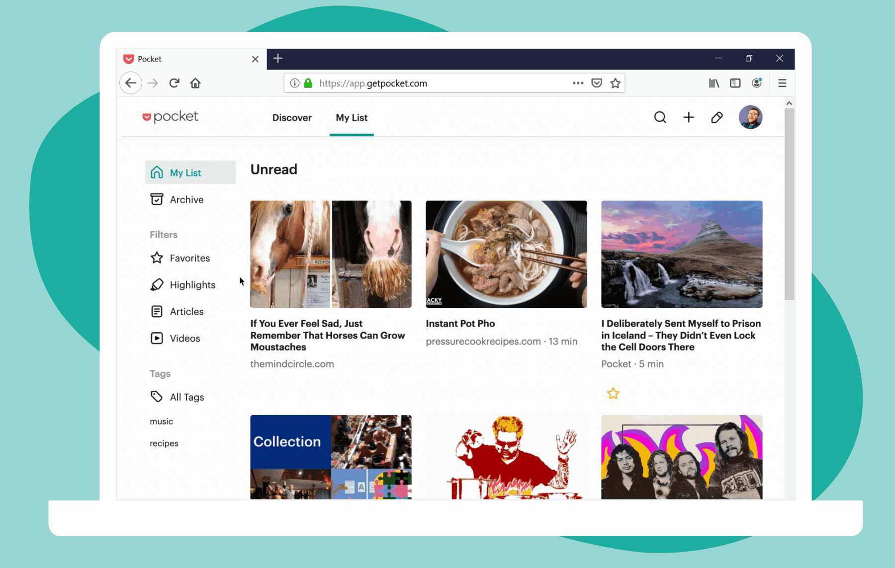

# Introducció a les xarxes socials
Novembre 2021
Sergi Xaudiera

---
<!-- backgroundColor: #fff -->
<!-- paginate: true -->

# Objectius

1. Aprofitar les xarxes socials i altres eines digitals per obtenir informació de manera més eficient.
2. Aprendre a publicar com un professional

---

# 1. Obertura i configuració dels comptes: aspectes generals
- Consells i recomanacions d’ús per al personal de la Generalitat
- Ús de comptes personals per a informacions, opinions i continguts relacionats amb l’activitat professional
- Consells i recomanacions de seguretat

---
# 1.1. Consells i recomanacions d’ús per al personal de la Generalitat

- Qualsevol treballador de la Generalitat pot expressar aquesta condició lliurament.
- Cal no usar el correu @gencat.cat per registrar els perfils personals.
- Es recomana actuar de forma transparent i respectant la legislació.
- No s’han de publicar comentaris despectius ni ofensius a internet.
- Ddurant la jornada laboral, cal fer  un bon ús de les XS i sempre orientat a aconseguir una millora del servei que s’ofereix.

---

# 1.2. Ús de comptes personals per a informacions, opinions i continguts relacionats amb l’activitat professional

- La informació rellevant sobre la feina s'ha de publicar primer en els canals corporatius.
- No es pot difondre informació ni documents als quals s'ha tingut accés en virtut del lloc de treball.
- Cal respectar les condicions d'ús dels continguts.

---

# 1.3. Consells i recomanacions de seguretat (1/2)

- Mantenir els sistemes operatius i programes actualitzats a la darrera versió.
- Protegir els dispositius amb contrasenya i amb bloqueig automàtic.
- Utilitzar les aplicacions oficials descarregades directament dels mercats d'aplicacions.
- Utilitzar contrasenyes complexes, renovar-les de manera periòdica i utilitzar una contrasenya única per a cada servei. 

---
# 1.3. Consells i recomanacions de seguretat (2/2)

- Activar el segon factor d'autenticació sempre que sigui possible.
- Evitar vincular els perfils de xarxes socials a altres aplicacions que no siguin les oficials per editar els continguts.
- Prioritzar la connexió pròpia (4G) i evitar xarxes de tercers, especialment xarxes wifi desconegudes.

---

# 2. Twitter
- Trobar continguts i persones d'interès. El cercador
- Crear i editar llistes
- Pocket

---

# 2.1 Trobar continguts i persones d'interès. El cercador

https://twitter.com

---

# 2.2. Crear i editar llistes

https://twitter.com

---

# 2.3. Pocket

https://getpocket.com/

---

# 3. RSS: contingut sindicat
- Què és el contingut sindicat (rss)? i com ens pot ajudar
- Com trobar rss
- Feedly
- Pocket Casts

---

# 3.1. Què és el contingut sindicat (rss)? i com ens pot ajudar

Un format web XML que s'utiltiza per publicar continguts actualtizats sovint, com ara llocs de notícies, blogs i podcasts, i per mitjà dels qualse es pot compartir la informació i usar-la en altres llocs web o programes.

font[ viquipèdia](https://ca.wikipedia.org/wiki/RSS)

---

# 3.2. Com trobar rss

- Buscar el literal en els webs (Control + F)
- Buscar la icona 
- Utilitzar extensions del navegador
  - Firefox [Awesome RSS](https://github.com/shgysk8zer0/awesome-rss)
  - Chrome [Get RSS Feed URL](https://github.com/shevabam/get-rss-feed-url-extension)
- Suggeriments de les aplicacions de lectura

---

# 3.3. Feedly

https://feedly.com/

---

# 3.4. Pocket Casts

https://www.pocketcasts.com/

---

# 4. Tweetdeck: gestió professional

-  Què és Tweetdeck
-  Vista en columnes

https://tweetdeck.twitter.com

--- 

# 4.1. Què és Tweetdeck

Aplicació de Twitter per gestionar els perfils de manera professional. 

---

# 4.2. Vista en columnes

- Lectura de llistes
- Cerques
- Cerques avançades

---

# 5. Publicació de contingut
- Què publiquem
- Com ha de de ser
- Accessibilitat
- Reutiltizació de contingut

---

# 5.1. Què publiquem (1/2)

Recordar que qualsevol contingut que publiquem a internet pot ser vist per a qualsevol persona en qualsevol moment, encara que en un primer moment ho compartim de manera "privada".

---
# 5.1. Què publiquem (2/2)

- Dinàmiques comunicatives
- Informació de servei
- Relacionar el contingut multiplataforma (quan sigui oportú)
- Aprofitar les tendències per reviure contingut

**SOBRETOT**
- Llegir el contingut abans de compartir-lo
- Comprovar la autenticitat de la font (domini)

---

# 5.2. Com ha de ser (1/2)

- Intenta crear continguts curts, clars i simples.
- Escriu en llenguatge natural i evita utilitzar frases fetes o figures retòriques.
- Presentar la informació com una seqüència d’accions:    
  -abans/després  problema/solució 
- Cal seguir l’ordre natural de la frase i en format actiu a l’hora d’escriure a les xarxes socials.

---

# 5.2. Com ha de ser (2/2)
- Usar etiquetes curtes i si és possible que ja s'estiguin utilitzant.
- Tenir molta cura de redactar sense faltes d'ortografia. 
- Utilitzar l'opció de Twitter que enllaça missatges a través de la resposta, o citar tuits. És una tècnica molt útil si es vol fer referència a continguts que s'han publicat prèviament. El nou missatge sortirà a la cronologia sota el missatge al qual s'ha enllaçat en ordre cronològic.

---

# 5.3. Accessibilitat

- Publicar les imatges amb text alternatiu
- Tots els continguts audiovisuals subtitulats
- Identificar i descriure les imatges que es publiquen
- Es recomana utilitzar adreces curtes
- Quan creem etiquetes la primera lletra de cada paraula anirà sempre amb majúscula #CreusDeSantJordi.
- Cal evitar la utilització d’acrònims.

---

# 5.4. Reutiltizació de contingut

Sempre s'ha de tenir en compte les llicències i no compartir el material del que no tinguem clara la llicència. 

 [Llicències](https://wiki.creativecommons.org/wiki/Wiki/cc_license_compatibility) que convé conèixer:

- CC0 (Generalitat de Catalunya)
- CC
- CC-BY

---

# 5.4. Reutiltizació de contingut (2)

Repositoris on trobar imatges i vídeos lliures de drets:
- [pixabay](https://pixabay.com/)
- [pexels](https://www.pexels.com/ca-es/)

---

# Materials

[Guia de xarxes socials](http://atenciociutadana.gencat.cat/ca/serveis/xarxes-i-missatgeria-instantania/xarxes-socials/guies-i-normativa/guia-de-xarxes-socials/)
[Ús segur de les xarxes socials corporatives en dispositius mòbils](http://atenciociutadana.gencat.cat/web/.content/manuals/xarxes/Guia_rapida_us_segur_xarxes_socials_corporatives.pdf) 
[Guia d'accessibilitat](http://atenciociutadana.gencat.cat/web/.content/manuals/accessibilitat/guia_accessibilitat.pdf)